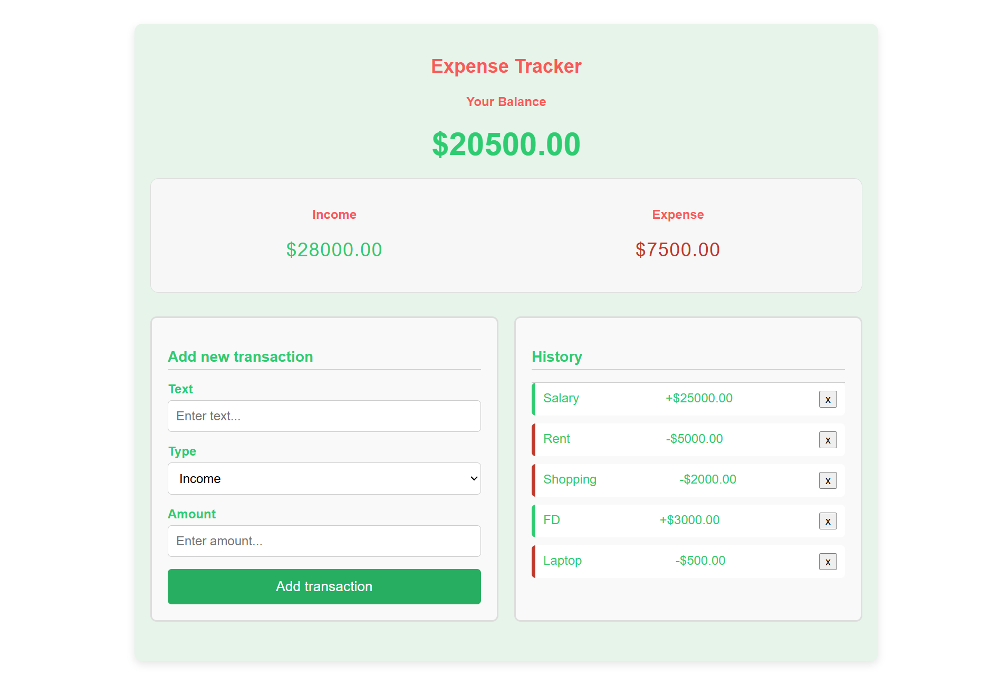

# 💰 Expense Tracker

An interactive and responsive Expense Tracker web application built using **HTML**, **CSS**, and **JavaScript**. It helps users manage their personal finances by adding, viewing, and deleting transactions, while dynamically updating the total balance, income, and expenses.

---

## 🔥 Features

- ✅ Add new income or expense transactions
- ✅ View transaction history
- ✅ Dynamically update balance, income, and expense totals
- ✅ Delete individual transactions
- ✅ Theme color changes based on total balance (green for positive, red for negative)
- ✅ Data persists using **Local Storage**

---

## 📸 Demo



---

## 🛠️ Technologies Used

- HTML5
- CSS3
- Vanilla JavaScript
- LocalStorage API

---

## 🚀 Getting Started

### 📁 Clone the repository:

  ```
  git clone https://github.com/your-username/expense-tracker.git
  cd expense-tracker
  ```

### ▶️ Open in browser:

Simply open the ```index.html``` file in your web browser.

--- 

## 📂 Project Structure

```
  expense-tracker/
├── index.html          # Main HTML file
├── style.css           # CSS styling
├── script.js           # JavaScript logic
└── README.md           # Project documentation
```

---

## 📄 License

This project is open-source and available under the MIT License.

---

## 🙌 Contact

[LinkedIn](https://www.linkedin.com/in/amrita-srivastava10/) | [GitHub](https://github.com/Amritasri10)
